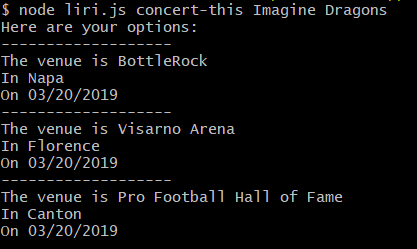
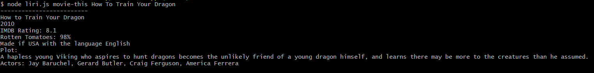
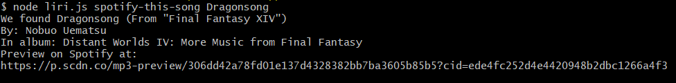

# Liri #
Acts upon these command line inputs: 
* 'concert-this <nameOfArtist>': Finds a concert
* 'spotify-this-song <songName>': Plays a song
* `movie-this <movieName>': Displays information about a movie
* `do-what-it-says <textDocumentPath>': Executes the command found in a text document

## Get Started ##
To use Liri, you will need to download, install the required packages with npm,
and supply your own .env file with your own Spotify API keys (including client secret).

## Using Liri ##
Some example commands, with their results:
* 
* 
* 
* 
#### When using a text document, the commands should comma separated and have no spaces outside the string: ####
* spotify-this-song,"I Want it That Way"
